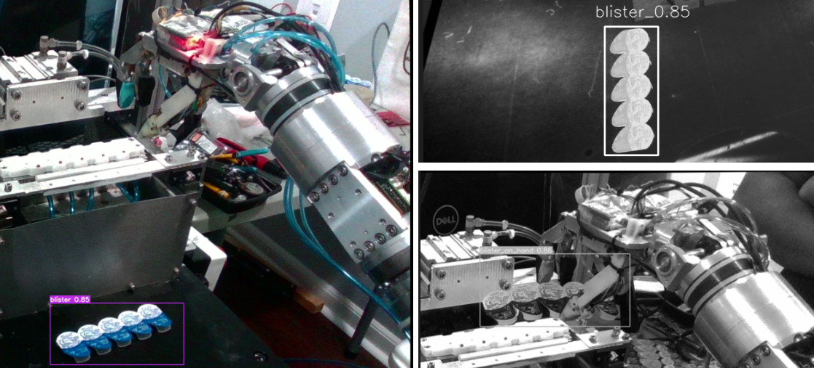
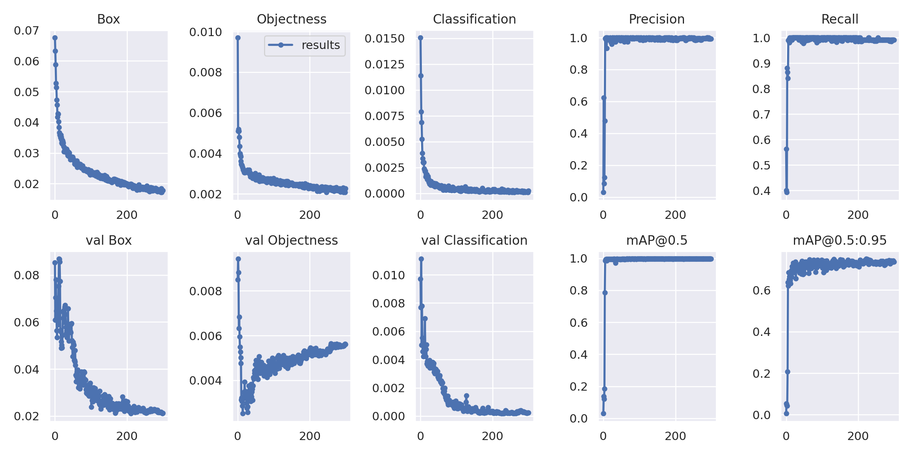

# Detect blister status using YOLOv7

In this project, we applied yolov7 to localize bounding box of blisters and classify them to see whether or not they are on hand. To ilustrate this, see figure 1 below.
<div align="center">
    <a href="./">
        
    </a>
</div>

## Install Requirements
------------------------ --------------------
<details><summary> <b>Expand</b> </summary>                  
                                                                  
| Package | Version  |  
| :-- | :-: |
|absl-py|**1.4.0**|   
|albumentations |**1.3.0**|
|appdirs |  **1.4.4** |               
|attrs |  **22.2.0**  |
| backcall| **0.2.0**  |                 
| cachetools|  **5.3.0**  |               
| certifi| **2022.12.7**|                   
| chardet| **4.0.0** |
|charset-normalizer| **3.1.0** | 
|clearml| **1.10.3** |
| click| **8.1.3**|
| clip | **0.2.0**   |                                      
| cycler|**0.11.0** |                             
| decorator|**5.1.1**|            
| docker-pycreds|**0.4.0**  |                      
| fonttools| **4.38.0** |                              
| furl |**2.1.3**   |        
| gitdb | **4.0.10** |            
| GitPython |**3.1.31** |             
| google-auth| **2.17.2**|              
| google-auth-oauthlib| **0.4.6** |               
| grpcio | **1.53.0**  |               
| idna   | **3.4** |                                       
| imageio | **2.27.0** |                 
| imgaug | **0.4.0** |                         
| importlib-metadata| **6.3.0** |                      
| importlib-resources| **5.12.0** |                       
| ipython| **7.34.0**|          
| jedi | **0.18.2**  |                     
| joblib | **1.2.0**  |                
| jsonschema| **4.17.3**|                
| kiwisolver| **1.4.4** |                    
| Markdown | **3.4.3** |             
| MarkupSafe| **2.1.2** |                                     
| matplotlib | **3.5.3** |                   
| matplotlib-inline| **0.1.6** |                      
| networkx | **2.6.3** |                        
| numpy | **1.21.6**|                         
| nvidia-cublas-cu11 | **11.10.3.66**|                                   
| nvidia-cuda-nvrtc-cu11| **11.7.99** |                                                      
| nvidia-cuda-runtime-cu11| **11.7.99** |                                       
| nvidia-cudnn-cu11| **8.5.0.96** |                             
| oauthlib| **3.2.2** |                                            
| opencv-python |**4.7.0.72** |                            
| opencv-python-headless| **4.7.0.72** | 
| orderedmultidict| **1.0.1** |                     
| packaging | **23.0** |                    
| pandas |**1.3.5**|                  
| parso |**0.8.3**|                                        
| pathlib2 |**2.3.7.post1**|                        
| pathtools|**0.1.2** |     
| pexpect |**4.8.0**|                              
| pickleshare |**0.7.5**|           
| Pillow|**9.5.0**|                  
| pip|**23.0.1** |                
| pkgutil_resolve_name| **1.3.10**|                  
| prompt-toolkit|**3.0.38**|                                                     
| protobuf|**3.20.1**|                         
| psutil|**5.9.4**|                                      
| ptyprocess|**0.7.0**|                                
| pyasn1|**0.4.8**|                 
| pyasn1-modules|**0.2.8** |           
| pycocotools|**2.0.6** |                
| Pygments|**2.14.0**|               
| PyJWT |**2.4.0**|               
| pyparsing|**3.0.9**|               
| pyrsistent|**0.19.3**|             
| python-dateutil|**2.8.2** |         
| python-dotenv|**0.21.1**|           
| pytz |**2023.3**|               
| PyWavelets|**1.3.0**|                              
| PyYAML|**6.0** |                
| qudida|**0.0.4**|            
| requests|**2.28.2**|              
| requests-oauthlib|**1.3.1**|           
| requests-toolbelt|**0.10.1**|          
| roboflow|**1.0.3**|       
| rsa|**4.9**|                       
| scikit-image |**0.19.3**|                                                      
| scikit-learn |**1.0.2**|                        
| scipy|**1.7.3**|                    
| seaborn|**0.12.2**|                
| sentry-sdk|**1.19.1**|                  
| setproctitle|**1.3.2**|                                                                          
| setuptools|**47.1.0**|                
| shapely|**2.0.1** |               
| six|**1.16.0**|                
| smmap|**5.0.0**|              
| tensorboard|**2.11.2**|             
| tensorboard-data-server|**0.6.1** |          
| tensorboard-plugin-wit|**1.8.1** |           
| thop |**0.1.1.post2209072238**|                                        
| threadpoolctl |**3.1.0**|                              
| tifffile |**2021.11.2** |                        
| torch  |**1.10.1+cu102** |                              
| torch-tb-profiler|**0.4.1** |                                                   
| torchaudio |**0.10.1+cu102** |                                           
| torchvision |**0.11.2+cu102**|                               
| tqdm   |**4.65.0** |                                 
| traitlets|**5.9.0**|                                       
| typing_extensions |**4.5.0**|                        
| ultralytics |**8.0.110**|                              
| urllib3 |**1.26.15** |                         
| wandb|**0.14.2** |                                                       
| wcwidth |**0.2.6**|                                      
| Werkzeug |**2.2.3** |                                        
| wget  |**3.2**  |                   
| wheel |**0.40.0**|                        
| zipp |**3.15.0**| 
   
</details>  


[](https://paperswithcode.com/sota/real-time-object-detection-on-coco?p=yolov7-trainable-bag-of-freebies-sets-new)
[](https://huggingface.co/spaces/akhaliq/yolov7)
<a href="https://colab.research.google.com/gist/AlexeyAB/b769f5795e65fdab80086f6cb7940dae/yolov7detection.ipynb"></a>
[](https://arxiv.org/abs/2207.02696)

## Data Format
<details><summary> <b>Expand</b> </summary> 

``` shell 
Yolov7_blister                              
    |
    |____blister_data                                                                             
    |        |
    |        |________crop_external_img                                        
    |        |
    |        |________crop_img                              
    |        |
    |        |_____images                       
    |        |       |_________blister                                          
    |        |       |_________images                        
    |        |       |_________test   # Test image                           
    |        |       |_________train  # Train image                 
    |        |       |_________val    # Validation data                         
    |        |
    |        |______labels                       
    |        |        |
    |        |        |____train                     
    |        |        |      |______.txt                  
    |        |        |
    |        |        |____val                    
    |        |        |      |_______.txt                             
    |        |        |
    |        |        |____classes.txt                      
    |        |
    |        |______predict_crop_data # images will be saved when run inference_blisters.py                                     
    |        |
    |        |______predict_test_data # images will be saved when run inference_blisters.py       
    |
    |______cfg            
    |
    |______command                    
    |         |______run.sh           
    |
    |______data         
    |         |_______blister.yaml                          
    |         |_______coco.yaml                      
    |         |_______hyp.scratch.custom.yaml                         
    |         |_______hyp.scratch.p5.yaml                        
    |         |_______hyp.scratch.p6.yaml                       
    |         |_______hyp.scratch.tiny.yaml                     
    |
    |______deploy               
    |
    |______figure                           
    |
    |______models                        
    |
    |______paper                     
    |
    |______runs                 
    |
    |______scripts                       
    |
    |______tools             
    |
    |______utils                       
    |
    |______wandb                                 
    |       
    |______detect.py # run inference file                      
    |
    |______export.py                  
    |
    |______hubconf.py                    
    |
    |______inference_blisters.py # Evaluate on new data                     
    |
    |______test.py   # Test                   
    |
    |______train.py  # Train         
    |
    |______train_aux.py  

```                                             

</details>  
            
## Download Yolov7 Weights                                                        
[`yolov7.pt`](https://github.com/WongKinYiu/yolov7/releases/download/v0.1/yolov7.pt) [`yolov7x.pt`](https://github.com/WongKinYiu/yolov7/releases/download/v0.1/yolov7x.pt) [`yolov7-w6.pt`](https://github.com/WongKinYiu/yolov7/releases/download/v0.1/yolov7-w6.pt) [`yolov7-e6.pt`](https://github.com/WongKinYiu/yolov7/releases/download/v0.1/yolov7-e6.pt) [`yolov7-d6.pt`](https://github.com/WongKinYiu/yolov7/releases/download/v0.1/yolov7-d6.pt) [`yolov7-e6e.pt`](https://github.com/WongKinYiu/yolov7/releases/download/v0.1/yolov7-e6e.pt)           

## Evaluation   
``` shell
# python test.py --data data/coco.yaml --img 640 --batch 32 --conf 0.001 --iou 0.65 --device 0 --weights yolov7.pt --name yolov7_640_val
python inference_blisters.py 
python detect.py --weights /home/tonyhuy/yolov7/runs/train/yolov725/weights/last.pt --device 1 --conf 0.3 --iou-thres 0.4 --img-size 320 --source /home/tonyhuy/yolov7/blister_data/images/test

```
The results will be saved here:

```
 Average Precision  (AP) @[ IoU=0.50:0.95 | area=   all | maxDets=100 ] = 0.51206
 Average Precision  (AP) @[ IoU=0.50      | area=   all | maxDets=100 ] = 0.69730
 Average Precision  (AP) @[ IoU=0.75      | area=   all | maxDets=100 ] = 0.55521
 Average Precision  (AP) @[ IoU=0.50:0.95 | area= small | maxDets=100 ] = 0.35247
 Average Precision  (AP) @[ IoU=0.50:0.95 | area=medium | maxDets=100 ] = 0.55937
 Average Precision  (AP) @[ IoU=0.50:0.95 | area= large | maxDets=100 ] = 0.66693
 Average Recall     (AR) @[ IoU=0.50:0.95 | area=   all | maxDets=  1 ] = 0.38453
 Average Recall     (AR) @[ IoU=0.50:0.95 | area=   all | maxDets= 10 ] = 0.63765
 Average Recall     (AR) @[ IoU=0.50:0.95 | area=   all | maxDets=100 ] = 0.68772
 Average Recall     (AR) @[ IoU=0.50:0.95 | area= small | maxDets=100 ] = 0.53766
 Average Recall     (AR) @[ IoU=0.50:0.95 | area=medium | maxDets=100 ] = 0.73549
 Average Recall     (AR) @[ IoU=0.50:0.95 | area= large | maxDets=100 ] = 0.83868

```

Single GPU training

``` shell
#____________________________________________ Run training file___________________________________________________#
# Image size 320
python train.py --workers 8 --device 3  --batch-size 8 --data data/blister.yaml --img 320  --cfg cfg/training/yolov7.yaml --weights 'yolov7.pt' --name yolov7 --hyp data/hyp.scratch.p5.yaml

# Image size 640
python train.py --workers 8 --device 1  --batch-size 8 --data data/blister.yaml --img 640  --cfg cfg/training/yolov7.yaml --weights 'yolov7.pt' --name yolov7 --hyp data/hyp.scratch.p5.yaml
```

## Result                                                      
[Weights and Bias running result](https://wandb.ai/huynguyen15/YOLOR/runs/6cj3l4xu?workspace=user-huynguyen15)  

<div align="center">
    <a href="./">
        
    </a>
</div>

## Citation

```
@article{wang2022yolov7,
  title={{YOLOv7}: Trainable bag-of-freebies sets new state-of-the-art for real-time object detectors},
  author={Wang, Chien-Yao and Bochkovskiy, Alexey and Liao, Hong-Yuan Mark},
  journal={arXiv preprint arXiv:2207.02696},
  year={2022}
}
```

```
@article{wang2022designing,
  title={Designing Network Design Strategies Through Gradient Path Analysis},
  author={Wang, Chien-Yao and Liao, Hong-Yuan Mark and Yeh, I-Hau},
  journal={arXiv preprint arXiv:2211.04800},
  year={2022}
}
```
## Web Demo

- Integrated into [Huggingface Spaces 🤗](https://huggingface.co/spaces/akhaliq/yolov7) using Gradio. Try out the Web Demo [](https://huggingface.co/spaces/akhaliq/yolov7)

## Acknowledgements

<details><summary> <b>Expand</b> </summary>

* [https://github.com/AlexeyAB/darknet](https://github.com/AlexeyAB/darknet)
* [https://github.com/WongKinYiu/yolor](https://github.com/WongKinYiu/yolor)
* [https://github.com/WongKinYiu/PyTorch_YOLOv4](https://github.com/WongKinYiu/PyTorch_YOLOv4)
* [https://github.com/WongKinYiu/ScaledYOLOv4](https://github.com/WongKinYiu/ScaledYOLOv4)
* [https://github.com/Megvii-BaseDetection/YOLOX](https://github.com/Megvii-BaseDetection/YOLOX)
* [https://github.com/ultralytics/yolov3](https://github.com/ultralytics/yolov3)
* [https://github.com/ultralytics/yolov5](https://github.com/ultralytics/yolov5)
* [https://github.com/DingXiaoH/RepVGG](https://github.com/DingXiaoH/RepVGG)
* [https://github.com/JUGGHM/OREPA_CVPR2022](https://github.com/JUGGHM/OREPA_CVPR2022)
* [https://github.com/TexasInstruments/edgeai-yolov5/tree/yolo-pose](https://github.com/TexasInstruments/edgeai-yolov5/tree/yolo-pose)

</details>
